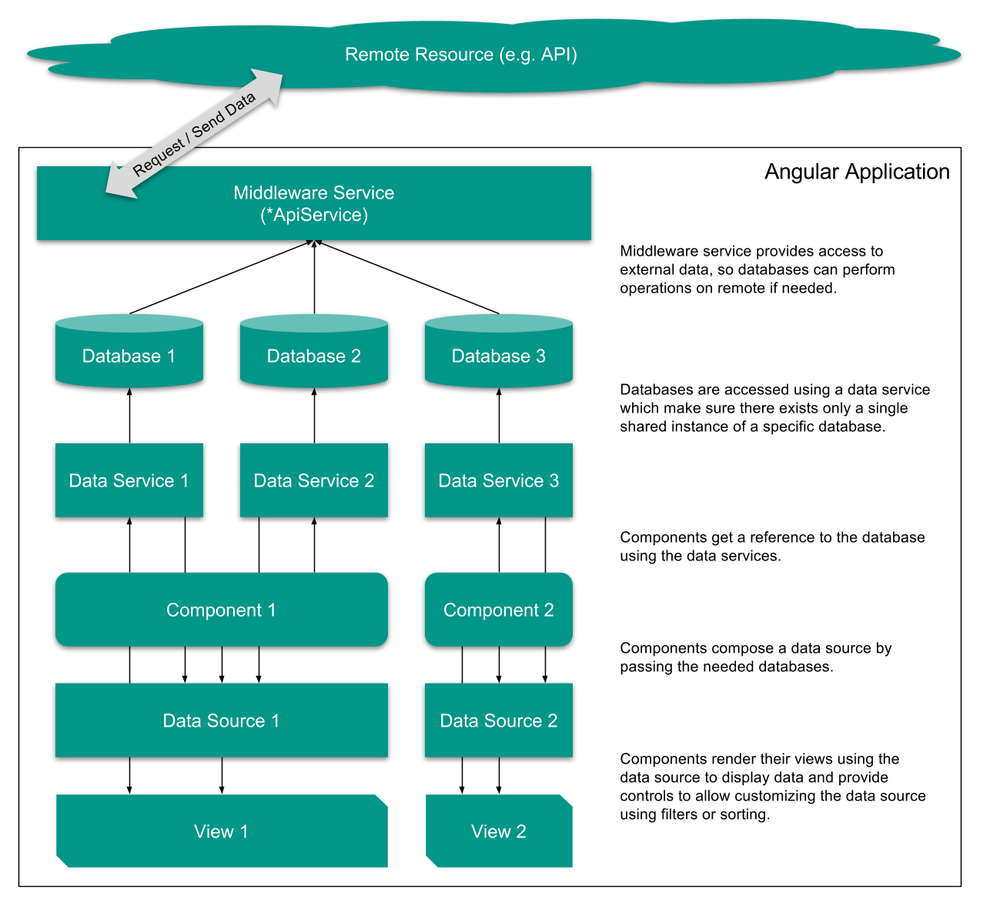

# Front End Architecture

## Folder structure

### Overview

```
/src
├── /app
│   ├── app.module.ts (AppModule)                         # [TS-0]
│   ├── app.page.html
│   ├── app.page.scss
│   ├── app.page.spec.ts
│   ├── app.page.ts
│   ├── app-routing.module.ts
│   ├── /modules
│   │   ├── /core (CoreModule)                            # [TS-1]
│   │   │   ├── core.module.ts
│   │   │   ├── /components                               # [TS-6]
│   │   │   │   ├── /footer (FooterComponent)
│   │   │   │   │   └── footer.component.html
│   │   │   │   │   └── footer.component.scss
│   │   │   │   │   └── footer.component.spec.ts
│   │   │   │   │   └── footer.component.ts
│   │   │   │   ├── /navbar (NavbarComponent)
│   │   │   │   │   └── navbar.component.html
│   │   │   │   │   └── navbar.component.scss
│   │   │   │   │   └── navbar.component.spec.ts
│   │   │   │   │   └── navbar.component.ts
│   │   │   ├── /pages                                    # [TS-5]
│   │   │   │   ├── /home (HomePage)
│   │   │   │   │   └── home.page.html
│   │   │   │   │   └── home.page.scss
│   │   │   │   │   └── home.page.spec.ts
│   │   │   │   │   └── home.page.ts
│   │   │   │   ├── /about (AboutPage)
│   │   │   │   │   └── about.page.html
│   │   │   │   │   └── about.page.scss
│   │   │   │   │   └── about.page.spec.ts
│   │   │   │   │   └── about.page.ts
│   │   ├── /shared (SharedModule)                        # [TS-2]
│   │   │   ├── shared.module.ts
│   │   │   ├── /components                               # [TS-6]
│   │   │   │   ├── /button (ButtonComponent)
│   │   │   │   │   └── button.component.html
│   │   │   │   │   └── button.component.scss
│   │   │   │   │   └── button.component.spec.ts
│   │   │   │   │   └── button.component.ts
│   │   │   │   ├── /page-content (PageContentComponent)
│   │   │   │   │   └── page-contentcomponent.html
│   │   │   │   │   └── page-contentcomponent.scss
│   │   │   │   │   └── page-contentcomponent.spec.ts
│   │   │   │   │   └── page-contentcomponent.ts
│   │   │   ├── /models                                   # [TS-8]
│   │   │   │   ├── api-error.model.spec.ts
│   │   │   │   ├── api-error.model.ts (ApiError)
│   │   │   ├── /utils                                    # [TS-4]
│   │   │   │   ├── array.util.spec.ts
│   │   │   │   ├── array.util.ts
│   │   │   │   ├── http.util.spec.ts
│   │   │   │   ├── http.util.ts
│   │   ├── /auth                                         # [TS-3]
│   │   │   ├── auth.module.ts
│   │   │   ├── auth-routing.module.ts
│   │   │   ├── /components                               # [TS-6]
│   │   │   │   ├── /auth-login (AuthLoginComponent)
│   │   │   │   │   └── auth-login.component.html
│   │   │   │   │   └── auth-login.component.scss
│   │   │   │   │   └── auth-login.component.spec.ts
│   │   │   │   │   └── auth-login.component.ts
│   │   │   ├── /pages                                    # [TS-5]
│   │   │   │   ├── /auth-login (AuthLoginPage)
│   │   │   │   │   └── auth-login.page.html
│   │   │   │   │   └── auth-login.page.scss
│   │   │   │   │   └── auth-login.page.spec.ts
│   │   │   │   │   └── auth-login.page.ts
│   │   │   ├── /services (AuthService)                   # [TS-7]
│   │   │   │   ├── auth.service.spec.ts
│   │   │   │   ├── auth.service.ts
│   │   ├── /exchange                                     # [TS-3]
│   │   │   ├── exchange-module.ts
│   │   │   ├── exchange-routing.module.ts
│   │   │   ├── /components                                   # [TS-6]
│   │   │   │   ├── /exchange-config (ExchangeConfigComponent)
│   │   │   │   │   └── exchange-config.component.html
│   │   │   │   │   └── exchange-config.component.scss
│   │   │   │   │   └── exchange-config.component.spec.ts
│   │   │   │   │   └── exchange-config.component.ts
│   │   │   │   ├── /exchange-config-list (ExchangeConfigListComponent)
│   │   │   │   │   └── exchange-config-list.component.html
│   │   │   │   │   └── exchange-config-list.component.scss
│   │   │   │   │   └── exchange-config-list.component.spec.ts
│   │   │   │   │   └── exchange-config-list.component.ts
│   │   │   │   ├── /exchange-wallet (ExchangeWalletComponent)
│   │   │   │   │   └── exchange-wallet.component.html
│   │   │   │   │   └── exchange-wallet.component.scss
│   │   │   │   │   └── exchange-wallet.component.spec.ts
│   │   │   │   │   └── exchange-wallet.component.ts
│   │   │   │   ├── /exchange-wallet-list (ExchangeWalletListComponent)
│   │   │   │   │   └── exchange-wallet-list.component.html
│   │   │   │   │   └── exchange-wallet-list.component.scss
│   │   │   │   │   └── exchange-wallet-list.component.spec.ts
│   │   │   │   │   └── exchange-wallet-list.component.ts
│   │   │   │   ├── /exchange-wallet-table (ExchangeWalletTableComponent)
│   │   │   │   │   └── exchange-wallet-table.component.html
│   │   │   │   │   └── exchange-wallet-table.component.scss
│   │   │   │   │   └── exchange-wallet-table.component.spec.ts
│   │   │   │   │   └── exchange-wallet-table.component.ts
│   │   │   ├── /data-sources                             # [TS-11]
│   │   │   │   └── exchanges.data-source.spec.ts
│   │   │   │   └── exchanges.data-source.ts
│   │   │   ├── /pages                                    # [TS-5]
│   │   │   │   ├── /exchanges-overview (ExchangesOverviewPage)
│   │   │   │   │   └── exchanges-overview.page.html
│   │   │   │   │   └── exchanges-overview.page.scss
│   │   │   │   │   └── exchanges-overview.page.spec.ts
│   │   │   │   │   └── exchanges-overview.page.ts
│   │   │   ├── /services                                 # [TS-9]
│   │   │   │   └── exchange-api.service.spec.ts
│   │   │   │   └── exchange-api.service.ts (ExchangeApiService)
│   │   │   ├── /storages                                 # [TS-10]
│   │   │   │   └── exchange.database.ts
│   │   │   │   └── exchange.provider.ts
├── /assets
├── /environments
│   ├── environment.prod.ts
│   └── environment.ts
├── /styles
├── favicon.ico
├── index.html
├── main.ts
├── polyfills.ts
├── styles.scss
├── tsconfig.app.json
├── tsconfig.spec.json
└── typings.d.ts
```

## Definitions

### [TS-0] The `AppModule`

The [`AppModule`][AppModule] is the main module and entry point of the Angular applications. Its the module that gets bootstraped in the [`main.ts`][main.ts].

It consists of 3 parts:

* [`module.ts`][AppModule] (`AppModule`)
  * the root module definition
  * imports external dependencies used in the whole application (like router, http, ...)
  * bootstraps routing using the [`routing.module.ts`](RoutingModule)
* [`routing.module.ts`][AppRoutingModule] (`AppRoutingModule`)
* [`app.page.ts`][AppPage] (`AppPage`)
  * The root page that gets mouted into the [`index.html`][index.html].

The `AppModule` is the only module allowed to import the [`CoreModule`][CoreModule].

### [TS-1] The [`CoreModule`][CoreModule]

* consists of all **common pages** and **global components** (only used once inside the app) needed only in the `AppModule` for running. This includes for example `HomePage`, `NavbarComponent` and `FooterComponent`.

* unlike other modules this module does not contain a routing module, since the routing for its pages is declared in the [AppRoutingModule][AppRoutingModule]

**Important**: This module must be imported by the `AppModule` only.

### [TS-2] [`SharedModule`][SharedModule]

* is a utility module that consists of all common components that can be used by any other module, like buttons or containers. Being a utility module, it does **not** have any pages (and therefore no routing).
* has a static `forRoot` method used for injecting it into the `AppModule` which ensures, that Providers included in this module will only be instanciated in the `AppModule`. This for example prevents services to be instanciated multiple times (^= in every module importing the SharedModule) but only the one using the `forRoot` injection - and so creates global Services that are only istanciated in the root scope.
* exports all of its components which should be available for other modules to use.

### [TS-3] Feature Modules

* are modules that encapsulate logic for a specific part of the application. E.g. the [`AuthModule`][AuthModule] contains pages, components and services that only beling to authentication, like a `LoginPage`, `LoginFormComponent` or `AuthService`.
* contains its own routing module (e.g. `AuthRoutingModule` in `modules/<name>/routing.module.ts`) which declares subroutes for all its pages.
* can export components to be available to other feature modules of the application, however for the sake of reducing dependency injections and cross references, it's encouraged to keep shared components in a shared module instead of a feature module.

### [TS-4] Utils

* contain pure functions that are useful to perform repeating tasks for keeping code DRY.
* should be either included in the SharedModule's folder - though they're not imported into modules or in feature modules if they're specific for a feature.
* in feature modules should only be used by that feature - otherwise, they need to be moved the shared folder.

### [TS-5] Pages

  * are a "dump" components, that contain as less logic as possible - or none at all.
  * use components to compose a view.
  * are the only components that are allowed to referenced in router modules - and therefore mounted.

### [TS-6] Components

  * are "clever" components, that contain logic for displaying data and allow user interaction
  * use `Inputs` to be configurable for their parent component or page

### [TS-7] Services

  * are providers that include logic and can be used to share data between components or other services

### [TS-8] Models

  * are interfaces used to describe data structure
  * as utils, they should be in a feature module if only used there (e.g. `ExchangeWallet`) - otherwise shared when used globally (e.g. `ApiError`)

### [TS-9] Services

  * are used for storing and providing data as well as component comunication
  * for details, see the Angular [docs about services][Angular_Services]

### [TS-10] Storage

The storage contains of two parts:

  * Databases
    * the Single Point of Truth for remote data
    * responsible for communicating with remotes
    * keep local and remote data in sync
    * are the only classes allowed to use remote middleware services (like *ApiService)
  * Providers
    * are the middleware between components and databases
    * assure that only a single instance of the database exists
    * provide the database to components, so it can be used to create views (data sources)

For details, see the "Data Flow" section.
    

### [TS-11] Data Sources

For details, see the "Data Flow" section.

## Naming Conventions

### (Feature) Modules

In general, there are only two types of feature modules

* regular modules
  * compose components, pipes, etc. into a feature module
* routing modules
  * contain only of a single import of `RouterModule.forChild` where they define and import the subroutes of the module
  * are imported into the regular module

| Module Naming  |       File Naming       |                                      |
| -------------- | ----------------------- | ------------------------------------ |
| Regular Module | FeatureOneModule        | module/feature-one/module.ts         |
| Routing Module | FeatureOneRoutingModule | module/feature-one/routing.module.ts |

### Components

 To avoid duplicate names, components are named after the module and path they're stored in. However, to avoid redundancy in the folder structure, components belonging into the same namespace can be grouped in folders.

 Bad example (following Angular style guide):

|          Component           |                                         Path                                         |
| ---------------------------- | ------------------------------------------------------------------------------------ |
| ExchangeWalletComponent      | modules/exchange/components/exchange-wallet/exchange-wallet.component.ts             |
| ExchangeWalletListComponent  | modules/exchange/components/exchange-wallet-list/exchange-wallet-list.component.ts   |
| ExchangeWalletTableComponent | modules/exchange/components/exchange-wallet-table/exchange-wallet-table.component.ts |

Good example (encouraged for avoiding redundancy in filesystem structure):

|          Component           |                         Path                          |
| ---------------------------- | ----------------------------------------------------- |
| ExchangeWalletComponent      | modules/exchange/components/wallet/component.ts       |
| ExchangeWalletListComponent  | modules/exchange/components/wallet/list/component.ts  |
| ExchangeWalletTableComponent | modules/exchange/components/wallet/table/component.ts |

*Note: the main `*Component` stays in `./` while a parent (`*ListComponent`) as well as child (`*TableComponent`) are in their own sub folders.*


## Routing

The application encourages lazy routing to only load parts of the application when needed.
Therefore all lazy loaded modules are defined in the [AppRoutingModule][AppRoutingModule] and will therefore start with their assigned path namespace.

### Example:

The feature module `AuthModule` is lazy loaded when accessing a `/auth/*` route. Therefore, the feature modules pages like `LoginPage` or `RegisterPage` can only be mounted in this specific namespace (`/auth/login` and `/auth/register`).

To be able to mount the `LoginPage` on `/login` (outside of the `/auth` namespace), it must be moved to the `CoreModule`, not the `AuthModule`.

## Data Flow

For a general overview, see Angular's guide on [ComponentInteraction][Angular_ComponentInteraction].

In the app we use the concept of Databases and DataSources to have centralized storages and clearly defined responsibilites for data storage, retrieval and presentation.

### Using Databases and Data Sources

The concept relies on 4 core services / classes:

* Middleware services for external communication (e.g. an api service)
* Databases for storing and providing data
* Data service for managing databases
  * ensuring single database instances
  * exposing those database instances
* Datasources for displaying data

#### Middleware Services

* are used to sync data with an external source
  * are the only services that are allowed to talk to that source
  * all requests for communication to that specific soruce must use the middleware
* in general **only databases** are allowed to use middleware services for external sources

#### Databases

* are the **Single Point of Truth** since they're the only instances allowed to use middleware services
* are a temporary in-app storage that stores data retrieved from a external source
  * they keep data in sync by performing local operations on remote as well via middleware services
  * may store data (semi-)permanently (e.g. in SessionStorage or LocalStorage) to store data between page visit

#### Data Services

* provide access to a database making sure there exists only a single instance of that database

#### Data Sources

* can be instanciated by any component as a layer on top of databases
* used for creating *views* by composing data from different databases, apply filtering and sorting, etc.

### Overview



Link to [Google Drawing](https://docs.google.com/drawings/d/1F0ZDOLvGN1256oWCMG-g8M76HafkbUS4ylxpTQ-Vwxo/edit?usp=sharing).

[index.html]: ../src/index.html
[main.ts]: ../src/main.ts

[AppModule]: ../src/app/module.ts
[AppRoutingModule]: ../src/app/module.ts
[AppPage]: ../src/app/app.page.ts

[CoreModule]: ../src/app/modules/core/module.ts
[SharedModule]: ../src/app/modules/shared/module.ts
[AuthModule]: ../src/app/modules/auth/module.ts

[Angular_ComponentInteraction]: https://angular.io/guide/component-interaction
[Angular_Services]: https://angular.io/tutorial/toh-pt4
